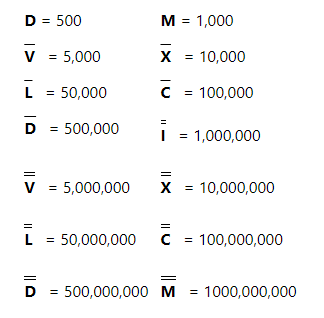

# Roman Numerals Converter

One day this will end up as another js npm lib.
For now **to use this library, simply clone the git repository.**

Even ChatGPT converts wrong!
But this library gets you covered if you please to bring back the glorious Roman Empire Numerals!

Example:


ChatGPT attempt:


---

# Roman Numerals Converter Library

## Overview

This library provides functionality to convert numbers into Roman numerals using different systems, including the standard system and the Vinculum/Apostrophus system for large numbers.

## Installation

To install the library, you can use npm or yarn:

```bash
 npm install roman-numerals-converter
```

or

```bash
 yarn add roman-numerals-converter
```

## Usage

### Importing the Converter

First, import the toRomanNumerals function into your project:

```typescript
import toRomanNumerals, { SystemTypes } from 'roman-numerals-converter';
```

### Converting Numbers

You can convert a number to Roman numerals by calling the toRomanNumerals function. The function takes two arguments: the number to convert and the system type ('Vinculum' or 'Apostrophus').

```typescript
const number = 1234;
const system: SystemTypes = 'Vinculum'; // or 'Apostrophus'

const romanNumeral = toRomanNumerals(number, system);
console.log(romanNumeral); // Output: "MCCXXXIV"
```

Full example:

```typescript
import toRomanNumerals from 'roman-numerals-converter';
import { SystemTypes } from './path-to-your-app-types';

const number = 52000;
const system: SystemTypes = 'Apostrophus';

const romanNumeral = toRomanNumerals(number, system);
console.log(romanNumeral); // Output: "ↇ ↀↀ"
```

## API

**`toRomanNumerals(input: number, system: SystemTypes): string | React.ReactElement`**

Converts a number to a Roman numeral string or a React element.

- `input`: The number to convert.
- `system`: The numeral system to use ('Vinculum' or 'Apostrophus').

**`individualRomanCharConverter(currNumber: number, currSingularChar: string, currHalfChar: string, currTenChar: string): string`**

Converts an individual number to a Roman numeral string.

- `currNumber`: The current number to convert (1-9).
- `currSingularChar`: The character representing the singular value (e.g., 'I').
- `currHalfChar`: The character representing the half value (e.g., 'V').
- `currTenChar`: The character representing the ten value (e.g., 'X').

### Contributing

Contributions are welcome! Please open an issue or submit a pull request.

### License

This project is licensed under the MIT License.

---

## Note

For numbers up to 3999, we Romans generally used:
| Individual decimal places |
| ----------------------------------- |

|     | Thousands | Hundreds | Tens | Units |
| --- | --------- | -------- | ---- | ----- |
| 1   | M         | C        | X    | I     |
| 2   | MM        | CC       | XX   | II    |
| 3   | MMM       | CCC      | XXX  | III   |
| 4   |           | CD       | XL   | IV    |
| 5   |           | D        | L    | V     |
| 6   |           | DC       | LX   | VI    |
| 7   |           | DCC      | LXX  | VII   |
| 8   |           | DCCC     | LXXX | VIII  |
| 9   |           | CM       | XC   | IX    |

But when numbers exceeded that, it was nessesary to invent some simplification.
It was nessesary to avoid adding more letters to system or ending up with something like that:

_15486 => MMMMMMMMMMMMMMMCDLXXXVI_

### Apostrophus

One of the working solutions, that Romans have developed, is **Apostrophus**:

Using the apostrophus method, 500 is written as IↃ, while 1,000 is written as CIↃ. This system of encasing numbers to denote thousands (imagine the Cs and Ↄs as parentheses) had its origins in Etruscan numeral usage.

Each additional set of C and Ↄ surrounding CIↃ raises the value by a factor of ten: CCIↃↃ represents 10,000 and CCCIↃↃↃ represents 100,000. Similarly, each additional Ↄ to the right of IↃ raises the value by a factor of ten: IↃↃ represents 5,000 and IↃↃↃ represents 50,000. Numerals larger than CCCIↃↃↃ do not occur.

This topic extends in the wikipedia article, but for simplicity I've handled larger numbers in this manner:

|                           |                               |
| ------------------------- | ----------------------------- |
| **IↃ** = **D** = 500      | **CIↃ** = **ↀ** = 1,000       |
| **IↃↃ** = **ↁ** = 5,000   | **CCIↃↃ** = **ↂ** = 10,000    |
| **IↃↃↃ** = **ↇ** = 50,000 | **CCCIↃↃↃ** = **ↈ** = 100,000 |

### Vinculum

This system came to use in late Roman Republic and continued into Middle Ages.
It vastly simplified handling larger numbers by putting bars, or "overlines" at the top of numbers, indicating multiplication by x1000:



All info and descriptions come from, or are based of [Wikipedia article](https://en.wikipedia.org/wiki/Roman_numerals) and [Tuomas Salste](https://www.tuomas.salste.net/doc/roman/converter.shtml)
